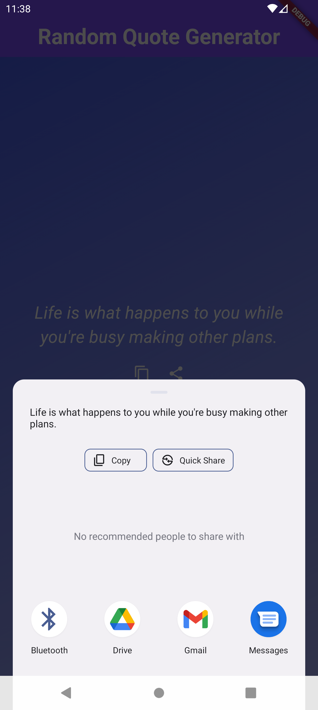

# Random Quote Generator App

A Flutter application that fetches random quotes from an API and allows users to copy or share them.


## Features

- Fetches random quotes from 'https://api.quotable.io/random'
- Displays the fetched quote with a random background color
- Copy quote to clipboard
- Share quote via other applications

## Screenshots




## Getting Started

To run this project locally, follow these steps:

### Prerequisites

- Flutter SDK installed
- Either Android/iOS device or emulator

### Installing

1. Clone the repository:

   ```bash
   git clone https://github.com/your-username/random_quote_generator.git
